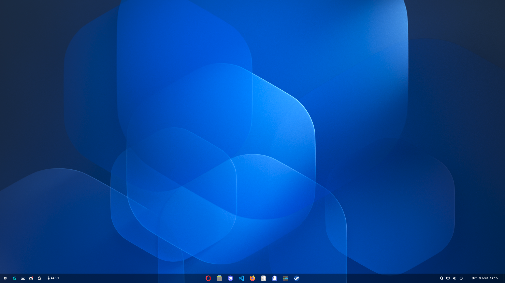

<h1 align="center">CachyOS Setup</h1>

  <strong>
    My personal CachyOS setup with GNOME, automated with Ansible.
  </strong>

  
  
  

  

## Software

| Purpose                | Choice                                                                                                                                                                                                     |
| ---------------------- | ---------------------------------------------------------------------------------------------------------------------------------------------------------------------------------------------------------- |
| Terminal               | [**Ghostty**](https://github.com/ghostty-org/ghostty)                                                                                                                                                      |
| System monitoring      | [**Mission Center**](https://gitlab.com/mission-center-devs/mission-center)                                                                                                                                |
| DNS provider           | [**NextDNS**](https://nextdns.io/) via [**systemd-resolved**](https://github.com/systemd/systemd) — routes all system DNS queries over DNS-over-TLS with DNSSEC validation                                 |
| Audio player           | [**Gapless**](https://gitlab.gnome.org/neithern/g4music)                                                                                                                                                   |
| Video player           | [**mpv**](https://github.com/mpv-player/mpv) — custom [**MVUtensils**](https://github.com/myrsloik/mvutensils) motion interpolation for TV-style motion smoothing, toggled with `Shift+I`                  |
| Media server           | [**Jellyfin**](https://github.com/jellyfin/jellyfin) — hardware-accelerated decoding on the AMD GPU                                                                                                        |
| Web browser            | [**Firefox**](https://github.com/mozilla-firefox/firefox)                                                                                                                                                  |
| Code editor            | [**Visual Studio Code**](https://github.com/microsoft/vscode)                                                                                                                                              |
| AI coding agent        | [**Oh My Pi (OMP)**](https://github.com/can1357/oh-my-pi)                                                                                                                                                  |
| Netflix browser        | **Opera** — the only browser that gives me 1080p Netflix playback on Linux                                                                                                                                 |
| RSS reader             | [**NewsFlash**](https://gitlab.com/news-flash/news_flash_gtk) — for following news from my favorite websites                                                                                               |
| Proton version manager | [**ProtonPlus**](https://github.com/Vysp3r/ProtonPlus) — manages [Proton-GE](https://github.com/GloriousEggroll/proton-ge-custom) and [Proton-CachyOS](https://github.com/CachyOS/proton-cachyos) versions |
| PDF toolkit            | [**Stirling PDF**](https://github.com/Stirling-Tools/Stirling-PDF)                                                                                                                                         |

## Machine profiles

The shared playbook configures both machines. It then selects one profile from
the local hostname, so hardware-specific packages and services do not leak
between them.

| Profile   | Hostname          | Additional configuration                                                                                                                |
| --------- | ----------------- | --------------------------------------------------------------------------------------------------------------------------------------- |
| `desktop` | `cachyos-desktop` | [**Wootility**](https://github.com/WootingKb/wootility-linux) and the [**Jellyfin**](https://github.com/jellyfin/jellyfin) media server |
| `laptop`  | `cachyos-laptop`  | `asusctl`, `supergfxctl`, `rog-control-center`, and `solaar`; `supergfxd` is enabled and started                                        |

## GNOME extensions

- [**Dash to Panel**](https://github.com/home-sweet-gnome/dash-to-panel) — provides a horizontal taskbar similar to Windows.
- [**Smart Home**](https://github.com/vchlum/smart-home) — controls my Philips Hue bridge.
- [**Vitals**](https://github.com/corecoding/Vitals) — displays and monitors system temperatures.

## Manual assets

- Import `roles/packages/files/newsflash/Newsflash.OPML` from the NewsFlash UI when initializing feeds.
- `show-elgato-output.sh` is a validated standalone helper. Run `./show-elgato-output.sh --help`; its default capture device is machine-specific and can be overridden with `--video-device` and `--sound-device`.

## Appearance

- **Icon theme:** [**Papirus**](https://github.com/PapirusDevelopmentTeam/papirus-icon-theme)
- **Default system font:** [**FreeSans**](https://www.gnu.org/software/freefont/) 12
- **Terminal font:** [**Inconsolata Medium**](https://github.com/googlefonts/Inconsolata) 14

## Ansible Vault password

> `vault_password_file` is intentionally omitted from `ansible.cfg`; `bootstrap.sh` supplies it only for `run` and `check`, so lint and CI do not depend on a local secret.
